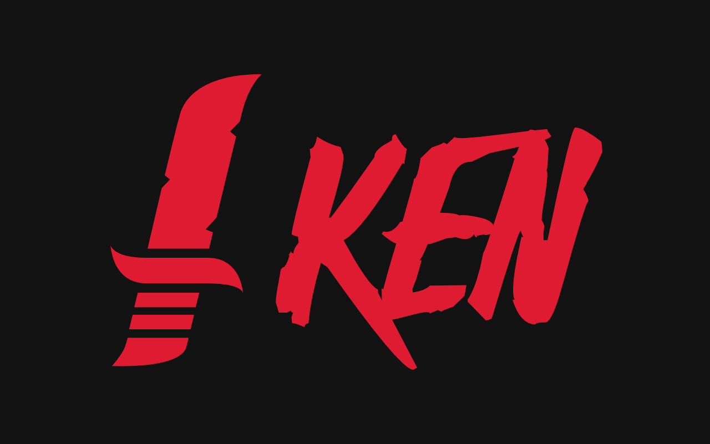

# ken &nbsp; [](https://pkg.go.dev/github.com/zekrotja/ken?tab=doc) [](https://goreportcard.com/report/github.com/zekrotja/ken)

> ⚠️ **Attention**  
> This package is still in a very early state of development and the API might get breaking changes until first official release.

剣 *(`ken` - japanese for `Sword`)* - A cutting edge *(haha)*, prototype, object-oriented and highly modular slash command handler for [Discordgo](https://github.com/bwmarrin/discordgo).

This work-in-progress slash command handler is designed to be used in future versions of [shinpuru](https://github.com/zekroTJA/shinpuru).

If you are interested how to use this package, see the [basic example](examples/basic). In [this](examples/middlewares) example, you can see how to use middlewares.

## Why should you use this package?

It sounds crazy, but `ken` tries to hide some of the complexity behind the slash command registration and handling while giving you full control over the event handling and registration process.

### High modularity due to OOP

The command registration and middleware system is built so that you can basically add whatever functionality you want to your command structures and handle everything with them in the middlewares which can be called before and/or after command execution. The only thing ken cares about is that the commands implement the basic [`Command`](https://pkg.go.dev/github.com/zekrotja/ken#Command) interface.

In the [middlewares example](https://github.com/zekroTJA/ken/tree/master/examples/middlewares), you can take a look how to implement custom functionalities to your command structure and how to handle it in the middlewares.

Via the options, you can also specify a custom state handler, if you are using something like [dgrs](https://github.com/zekrotja/dgrs), for example.

### Quality of Life Implementations

`ken` passes a single [`Ctx`](https://pkg.go.dev/github.com/zekrotja/ken#Ctx) object to the command handlers which contains everything you need. It allows you to access raw `discordgo.InteractionCreate` event data, the `Command` instance which has been called, the `discordgo.Session` of course as well as a whole lot of utility functionalities.

For example, you can easily anwer to the event by using the [`Respond`](https://pkg.go.dev/github.com/zekrotja/ken#Ctx.Respond) method to send the response to an interaction. [`Defer`](https://pkg.go.dev/github.com/zekrotja/ken#Ctx.Defer) does the same but simply sends the `defer` response so you can send follow up messages afterwards with a delay.

Speaking of follow up messages, there are some simple functions like [`FollowUp`](https://pkg.go.dev/github.com/zekrotja/ken#Ctx.FollowUp), [`FollowUpEmbed`](https://pkg.go.dev/github.com/zekrotja/ken#Ctx.FollowUpEmbed) or [`FollowUpError`](https://pkg.go.dev/github.com/zekrotja/ken#Ctx.FollowUpError) to make building these follow up messages easier. These functions also return a single [`FollowUpMessage`](https://pkg.go.dev/github.com/zekrotja/ken#FollowUpMessage) object so that you can chain other stuff like `DeleteAfter` to delete the follow up message after a given time span. 🤯

The `Ctx` also allows you to handle sub commands using [`HandleSubCommands`](https://pkg.go.dev/github.com/zekrotja/ken#Ctx.HandleSubCommands). Simply pass a name and a handler function in a [`SubCommandGandler`](https://pkg.go.dev/github.com/zekrotja/ken#SubCommandHandler) to build your sub command tree. The sub command handlers are getting passed a specialized [`SubCommandCtx`](https://pkg.go.dev/github.com/zekrotja/ken#SubCommandCtx), which scopes the `Options` method to the options of the sub command. So you can handle your options like in a top level command.

## Performance

To avoid registering and unregistering commands everytime the bot restarts, ken allows to cache commands using a [`CommandStore`](https://pkg.go.dev/github.com/zekrotja/ken@v0.6.1/store#CommandStore). This is defaultly disabled, but if you want, you can use the default implementation [`LocalCommandStore`](https://pkg.go.dev/github.com/zekrotja/ken@v0.6.1/store#LocalCommandStore) which stores the commands in a file to be re-used on the next startup. Or simply implement your own store [using Redis](https://github.com/zekroTJA/shinpuru/tree/dev/pkg/rediscmdstore), for example.


## Example Usage

```go
package main

// imports ...

type TestCommand struct{}

var _ ken.Command = (*TestCommand)(nil)

func (c *TestCommand) Name() string {
	return "ping"
}

func (c *TestCommand) Description() string {
	return "Basic Ping Command"
}

func (c *TestCommand) Version() string {
	return "1.0.0"
}

func (c *TestCommand) Type() discordgo.ApplicationCommandType {
	return discordgo.ChatApplicationCommand
}

func (c *TestCommand) Options() []*discordgo.ApplicationCommandOption {
	return []*discordgo.ApplicationCommandOption{}
}

func (c *TestCommand) Run(ctx *ken.Ctx) (err error) {
	err = ctx.Respond(&discordgo.InteractionResponse{
		Type: discordgo.InteractionResponseChannelMessageWithSource,
		Data: &discordgo.InteractionResponseData{
			Content: "Pong!",
		},
	})
	return
}

func main() {
	token := os.Getenv("TOKEN")

	session, err := discordgo.New("Bot " + token)
	if err != nil {
		panic(err)
	}
	defer session.Close()

	k := ken.New(session)
	k.RegisterCommands(
		new(commands.TestCommand),
	)

	defer k.Unregister()

	err = session.Open()
	if err != nil {
		panic(err)
	}

	sc := make(chan os.Signal, 1)
	signal.Notify(sc, syscall.SIGINT, syscall.SIGTERM, os.Interrupt, os.Kill)
	<-sc
}
```

You can also find a "real world" implementation in my Discord bot [shinpuru](https://github.com/zekrotja/shinpuru), where ken is used as main slash command framework.

---

© 2021 Ringo Hoffmann (zekro Development).  
Covered by the MIT Licence.
