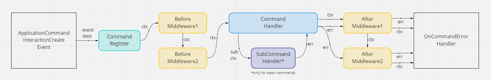

# ken &nbsp; [](https://pkg.go.dev/github.com/zekrotja/ken?tab=doc) [](https://github.com/zekroTJA/ken/releases) [](https://goreportcard.com/report/github.com/zekrotja/ken)

> ⚠️ **Disclaimer**  
> This package is still in a very early state of development and future updates might include breaking changes to the API until the first official release.

剣 *(`ken` - japanese for `Sword`)* - A cutting edge *(haha)*, prototype, object-oriented and highly modular slash-command handler for [Discordgo](https://github.com/bwmarrin/discordgo).

This work-in-progress slash-command handler is designed to be used in future versions of [shinpuru](https://github.com/zekroTJA/shinpuru).

For basic usage examples, see the [basic example section](examples/basic). Examples on how to use middlewares can be found [here](examples/middlewares).

## Why should you use this package?

It may sound crazy, but `ken` tries to simplify the complexity behind slash-command registration and command handling while giving you full control over the event handling and registration process.

### High modularity due to OOP

The command-registration and middleware system is built so that you can add whatever functionality you want to your command structure and handle it all in your middleware which can be called before and/or after command execution. The only thing required is that your commands implement the basic [`Command`](https://pkg.go.dev/github.com/zekrotja/ken#Command) interface.



In the [middleware example](examples/middlewares), you can take a look at how to implement custom functionality in your command structure and add middleware functions to handle these.

Via options you can also specify a custom state handler, if you are using something like [dgrs](https://github.com/zekrotja/dgrs) for example.

### Quality of Life Implementations

`ken` passes a single [`Ctx`](https://pkg.go.dev/github.com/zekrotja/ken#Ctx) object to the command handlers which contains everything you need. It allows you to access raw `discordgo.InteractionCreate` event data, the `Command` instance which has been called, the `discordgo.Session`, as well as many utility functions.

For example, you can easily respond to the event by using the [`Respond`](https://pkg.go.dev/github.com/zekrotja/ken#Ctx.Respond) method to send a response to an interaction. [`Defer`](https://pkg.go.dev/github.com/zekrotja/ken#Ctx.Defer) does the same but sends a `defer` response so you can send follow-up messages afterwards with a delay.

Speaking of follow-up messages, there are some simple functions like [`FollowUp`](https://pkg.go.dev/github.com/zekrotja/ken#Ctx.FollowUp), [`FollowUpEmbed`](https://pkg.go.dev/github.com/zekrotja/ken#Ctx.FollowUpEmbed) or [`FollowUpError`](https://pkg.go.dev/github.com/zekrotja/ken#Ctx.FollowUpError) to make building these follow-up messages easier. These functions return a single [`FollowUpMessage`](https://pkg.go.dev/github.com/zekrotja/ken#FollowUpMessage) object so that you can chain calls like `DeleteAfter` to delete the follow-up message after a given timespan. 🤯

The `Ctx` also allows you to handle sub-commands using [`HandleSubCommands`](https://pkg.go.dev/github.com/zekrotja/ken#Ctx.HandleSubCommands). Simply pass a name and handler function as [`SubCommandHandler`](https://pkg.go.dev/github.com/zekrotja/ken#SubCommandHandler) to build your sub-command tree. The sub-command handlers are passed a specialized [`SubCommandCtx`](https://pkg.go.dev/github.com/zekrotja/ken#SubCommandCtx), which scopes the `Options` method to the options of the sub-command. So you can handle options like you would in a top-level command. In [this](https://github.com/zekroTJA/ken/tree/master/examples/subcommands) example you can see a practical implementation of sub-commands.

## Performance

To avoid registering and unregistering commands everytime the bot restarts, `ken` allows to cache commands using a [`CommandStore`](https://pkg.go.dev/github.com/zekrotja/ken@v0.6.1/store#CommandStore). Although disabled by default, the provided default implementation [`LocalCommandStore`](https://pkg.go.dev/github.com/zekrotja/ken@v0.6.1/store#LocalCommandStore) can be used. It stores the commands in a file which will be tried to read from on the next startup. You can also implement your own store, with [Redis](https://github.com/zekroTJA/shinpuru/tree/dev/pkg/rediscmdstore) for example.

`ken` uses `sync.Pool` as object pools for the command context which are used for command and sub-command execution. This is done to avoid creating a new context object for each command execution which would put strain on the garbage collector, especially on high command execution frequencies. 

## Example Usage

```go
package main

// imports ...

type TestCommand struct{}

var _ ken.Command = (*TestCommand)(nil)

func (c *TestCommand) Name() string {
	return "ping"
}

func (c *TestCommand) Description() string {
	return "Basic Ping Command"
}

func (c *TestCommand) Version() string {
	return "1.0.0"
}

func (c *TestCommand) Type() discordgo.ApplicationCommandType {
	return discordgo.ChatApplicationCommand
}

func (c *TestCommand) Options() []*discordgo.ApplicationCommandOption {
	return []*discordgo.ApplicationCommandOption{}
}

func (c *TestCommand) Run(ctx *ken.Ctx) (err error) {
	err = ctx.Respond(&discordgo.InteractionResponse{
		Type: discordgo.InteractionResponseChannelMessageWithSource,
		Data: &discordgo.InteractionResponseData{
			Content: "Pong!",
		},
	})
	return
}

func main() {
	token := os.Getenv("TOKEN")

	session, err := discordgo.New("Bot " + token)
	if err != nil {
		panic(err)
	}
	defer session.Close()

	k := ken.New(session)
	k.RegisterCommands(
		new(commands.TestCommand),
	)

	defer k.Unregister()

	err = session.Open()
	if err != nil {
		panic(err)
	}

	sc := make(chan os.Signal, 1)
	signal.Notify(sc, syscall.SIGINT, syscall.SIGTERM, os.Interrupt, os.Kill)
	<-sc
}
```

You can also find a "real world" implementation in my Discord Bot [shinpuru](https://github.com/zekrotja/shinpuru), where `ken` is used as main slash command framework.

## FAQ

### Why do my commands not show up in Discord?

This may have multiple reasons.

1. Check if you invited your Bot with the `applications.commands` OAuth2 scope. This option was added for bots to be permitted to create slash commands for a guild. When you already invited your bot before that, the bot will not be able to register slash commands. To fix this, simply kick the bot and re-invite it with an invite link containing the required `applications.commands` scope.  
    > **Pro-Tip:** You can go to the `OAuth2` Page in the Discord Application settings to generate a suitable invite link.  
    

2. When a command needs to be created (if you start the bot with a newly added command), It may take up to 15-30 minutes *(based on personal experience)* until the command shows up in Guilds. After that *(when CommandStore is enabled)*, commands are re-used and updated, which does not take that much time.  
    > **Pro-Tip:** To create a command, you just need to specify a valid name, description and options and add it to ken's handler register. After that, start the bot in the background and then implement the command logic to bridge the time until the command shows up to test it.

3. As I have experienced personally, sometimes, you might need to restart your Discord client until commands show op on Guilds. And sometimes you even need to kick and re-invite the bot so that they show up. I don't really know if this is a registration issue on ken's site. If you know more about that, please let me know!

### Why do I get the error `command name is invalid`?

Discord has some very strong restrictions to the naming of commands and command options. The name of a command, sub command or command option must be unique and must match the regex [`^[a-z0-9-_]{1,32}$`](https://regexr.com/676jb)¹.

If you are not familiar with regex, the name must match the following conditions:
- It must only contain lowercase letters, numbers, dashes and underscores.
- It must be at least 1 character and at most 32 characters long.

*¹ The pattern described in the Discord docs `^[\w-]{1,32}$` is actually not accurate, because you can not use uppercase letters in names, but you can use underscores.*

---

© 2021 Ringo Hoffmann (zekro Development).  
Covered by the MIT Licence.
